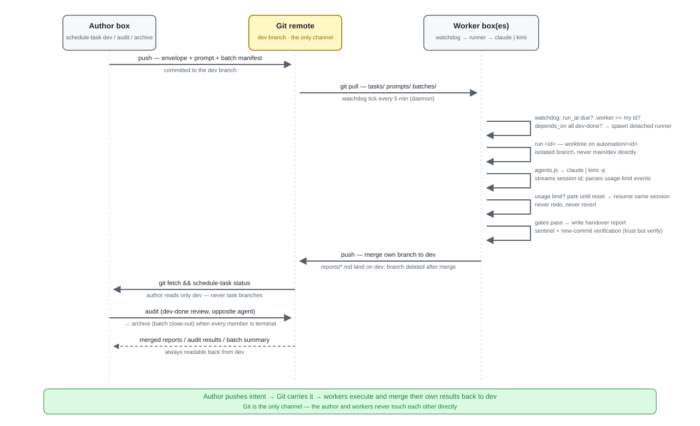

# schedule-task

A SKILL.md-compatible skill that any coding agent CLI (Kimi Code, Claude Code, Codex) can load to
author **scheduled, resumable automation tasks** — dev / test / audit — that a deterministic
watchdog executes unattended on a worker box (e.g. a VPS). You describe the work in natural
language from any repo; the skill produces a routing envelope + a plan-harness prompt (plus a
batch manifest for multi-task requests), commits them to the repo's inbox branch, and the worker
picks them up at the scheduled time, survives usage-limit windows, and pushes back results.
Authoring is agent-neutral (any SKILL.md-compatible agent); execution is not — the worker runs
tasks through the `claude` or `kimi` executor CLIs only (see `references/envelope-schema.md`).

Git is the only channel: you push *intent*, workers merge *results* back to `dev`.



*(All `tasks/` `prompts/` `reports/` `batches/` `state/` `templates/` above live under the
repo's `.schedule-tasks-data/` directory — the per-project private data dir.)*

Key properties: no AI in the control loop (the orchestrator is deterministic Node); add-only git
design (no merge conflicts on the bus); gates as prose (polyglot — any language's repo); resume
via CLI session ids (no work lost or redone across limit windows); per-task worktrees + branches;
machine identity (`state/.machine`) so an author box and several workers never race; workers only
execute, the author merges finished batches (dependency-ordered, PR optional).

## Runtime: one CLI, two dependencies

The whole runtime is the **`schedule-task` CLI** — a single zero-dependency Node program. The
only hard requirements are **node ≥ 18** and **git**.

The install is **three-layer separated** (see `docs/refactor-three-layer-separation.md`): the
CLI is installed **once per machine** as a global command by `install.sh` (`npm install -g`),
the skill is bound into each agent as knowledge (SKILL.md/references/templates, **zero code**)
by `schedule-task install`, and `.schedule-tasks-data/` is per-project data. The CLI runs the
same everywhere:

```bash
schedule-task --help      # every command
schedule-task doctor      # env health check (node/git/claude/kimi/graphify) — prints CLI vX · data schema vY
schedule-task self-test   # run the node:test suite
schedule-task version     # the CLI version
schedule-task install     # bind the knowledge layer (the skill) into an agent
```

## Install

Two steps — one installs the tool, the other binds the knowledge. There is no `update`
subcommand: re-running these two commands is how you update.

**Step 1 — the global CLI (one command, once per machine):**

```bash
# at a terminal, from a public repo:
curl -fsSL https://raw.githubusercontent.com/smart-kind/schedule-task-skill/main/install.sh | bash
# or, for development, from a clone of the repo:
./install.sh            # add --dry-run to preview
```

install.sh does `npm install -g` from a self-contained tarball (a real copy, never a symlink to
the source), putting the `schedule-task` command on PATH. **That is all it does** — it does not
touch any agent's skills dir, and it has no `--platform` concept. Re-running it replaces the
global CLI.

**Step 2 — bind the skill into each agent (the knowledge layer, zero code):**

```bash
schedule-task install --target all
```

This copies **SKILL.md / references/ / templates/** — and nothing else — from the global CLI
package into each installed platform's `skills/schedule-task` (`~/.kimi-code`, `~/.claude`,
`~/.agents`). Whole-dir overwrite: idempotent, and it automatically cleans up old-form code
residue. A `.installed-from` marker records the source CLI version + time.

**Have an AI agent install it for you.** In your agent (Kimi Code, Claude Code, Codex, …), say:

> Install this skill for me: https://github.com/smart-kind/schedule-task-skill — read README.md first, then follow its install instructions. If it is already installed, re-run install.sh and `schedule-task install --target all` to refresh it.

### install.sh flags

| Flag | Meaning |
|---|---|
| `--dry-run` | Print what would happen without changing anything. |

That is the only flag — platform selection and skill binding are `schedule-task install`'s job.

**Update later:** edit the skill source repo, commit and release, then on each machine re-run
the Step 1 one-liner (replaces the global CLI) and `schedule-task install --target all`
(refreshes the bound skills — idempotent). A `~/.local/bin/schedule-task` symlink leftover from
older versions is never touched by the CLI — remove it by hand at your convenience.

### Per-tool notes

- **Kimi Code** and **Codex** natively scan `~/.agents/skills/` (user-level) — pass `agents`
  (or `kimi-code`, Kimi Code's own dir).
- **Claude Code** does not read `.agents/skills/` — it only loads `~/.claude/skills/`, so pass
  `claude` for it.
- You can bind into several platforms on the same machine; each gets its own independent copy
  (no shared links, so nothing breaks when paths differ across machines).

## Quickstart

1. **Install the runtime into a target repo** (once per repo, once per machine). Open the repo
   in your agent and ask to "initialize automation", or run `schedule-task init`. It asks what
   this machine is (role `author` or `worker`) and its machine id, writes
   `.schedule-tasks-data/state/.machine` (gitignored), creates the data directories
   `.schedule-tasks-data/{tasks,prompts,reports,batches,state,templates,hooks}/` with a no-op
   `hooks/notify.sh`, stamps the committed data schema version (`.schedule-tasks-data/version`),
   merges the gitignore snippet, checks dependencies (`node`, `git`, plus
   `claude` or `kimi`), and — only for a `worker` — prints the watchdog command:
   ```
   schedule-task watchdog start --repo <repo>
   ```
   Run it on the worker: a resident daemon checks for due tasks every 300 s (default;
   `--interval <s>` to change) and launches them as detached runners. No cron needed. Inspect or
   stop it with `schedule-task watchdog status | stop`; after a reboot, `start` again (or add it
   to the login startup). `.schedule-tasks-data/state/` stays worker-local
   (gitignored). If the repo still has the old `automation/` data dir, `init` offers to migrate
   it (move + rewrite `prompt_file` paths).
2. **Open a dev batch.** In the repo, tell your agent: "start a dev batch: <what you want done>,
   run it tonight at 02:00 UTC". The skill runs `schedule-task dev` (it refuses while a batch is
   still open), interviews you (mission, gates in plain language, worker assignment, guardrails,
   schedule), splits the requirement into subtasks if needed, drafts the envelopes + prompts
   (from `templates/dev-plan-harness.md`), shows them for review, and commits to the inbox branch
   (`dev`).
3. **Watch it.** From the worker: `schedule-task status` (live state) and
   `schedule-task log <id> -f` (live stream). From the author
   box: `git fetch && schedule-task status` (reads the reports merged to `dev` — no branch
   awareness needed). Each finished dev task is merged to `dev` by its executor with a handover
   report; `schedule-task` (bare) is also status.
4. **Audit + close.** When every dev task is `dev-done`, run `schedule-task audit`
   (`--edit`/`--readonly`, `--per-task`/`--batch` — the auditor uses the opposite agent and
   reviews code + test meaningfulness). When every member is terminal, close the batch with
   `schedule-task archive` (batch summary + archive/ + current batch cleared).

## Repo layout

```
schedule-task/
├── SKILL.md                  # the skill: status (default) / dev / audit / archive / init / watchdog / cancel / log / migrate / doctor / install / version
├── README.md                 # this file
├── package.json              # zero runtime deps; bin → bin/schedule-task.js; npm test
├── install.sh                # tool layer only: global CLI via npm pack + npm install -g
├── bin/schedule-task.js      # CLI launcher (shebang; everything is in src/)
├── src/                      # the whole runtime — one module per concern
│   ├── cli.js                # command table + arg parsing + help
│   ├── core.js               # paths, machine identity, current batch, state/notes/pid, notify hook, env seams
│   ├── git.js                # thin `git` wrappers (the only external channel)
│   ├── agents.js             # coding-agent router: claude/kimi profiles, stream-json parsing
│   ├── runner.js             # resilient per-task runner (worktree, resume, limit-park, merge verify, report)
│   ├── dispatch.js           # the tick: eligibility, concurrency cap, detached spawn (called by watchdog)
│   ├── watchdog.js           # watchdog start/stop/status — the resident daemon loop
│   ├── status.js             # read-only reporter (worker/author modes, batch grouping)
│   ├── audit.js              # AUTHOR-side audit creation (mode + granularity, opposite agent)
│   ├── cancel.js             # cancel + cascade + process-group kill
│   ├── archive.js            # AUTHOR-side batch close-out (summary + archive/)
│   ├── init.js               # per-repo setup + automation/ migration
│   ├── install.js            # bind the knowledge layer (SKILL.md/references/templates) into an agent
│   ├── log.js                # `log <id> [-f]` — tail a run log
│   ├── migrate.js            # deterministic data-schema upgrade (stamps .schedule-tasks-data/version)
│   └── doctor.js             # environment health check
├── templates/
│   ├── harness-common.md     # shared task rules (graphify, TEST_HEADER, checkpoints, resume)
│   ├── dev-plan-harness.md   # dev task prompt skeleton (report + merge protocol)
│   ├── audit-harness.md      # audit task prompt skeleton (readonly/edit, verdict)
│   └── hooks/notify.sh       # default no-op hook (copied per repo at init)
├── references/
│   ├── envelope-schema.md    # tasks/<id>.json + batches/<batch>.json + state contract
│   ├── architecture.md       # runtime design (trigger/driver layers) + three-layer install topology
│   └── operations.md         # logs, watching, stuck-task recovery, notify hook
└── tests/                    # node:test suite (no VPS, no network, mock agent CLI)
```

Per-project data (created by `init`, gitignored part is `state/`):

```
<repo>/.schedule-tasks-data/
├── version                                  # committed data schema version (upgraded by `schedule-task migrate`)
├── tasks/  prompts/  reports/  batches/  templates/   # committed (each has archive/ where applicable)
├── state/                                  # gitignored: .machine, <id>, <id>.notes, <id>.pid, .watchdog.pid, .watchdog.status
└── hooks/notify.sh                         # per-project notification hook
```

Worker-local run state (per machine, per repo): `~/.local/state/schedule-task/<repo-basename>/`
with `<id>/run.log`, `<id>/attempt-<n>.jsonl`, `<id>/session_id`, `worktrees/<id>`,
`watchdog.log`.

## Program version vs data schema

Two version numbers are managed separately:

- **Program version** (`package.json` version, printed as `CLI vX`) — bumps on any code change.
- **Data schema** (`.schedule-tasks-data/version`, printed as `data schema vY`) — the format
  contract of `envelope`/`prompt`/`report`/`state`. Bumps only when the data formats change.

`status`/`doctor` print both on one line (`CLI v3.2.0 · data schema v1`). The rule is:

- data schema **<** CLI schema → **needs `schedule-task migrate`** (read commands warn and keep
  working; write commands `run`/`audit`/`cancel`/`archive` **hard-stop** with a migrate hint).
- data schema **>** CLI schema → the CLI is too old; refuse and upgrade the CLI
  (re-run install.sh).
- equal → normal operation.

`migrate` is deterministic (no AI): it upgrades the committed schema version in place. Commit the
current state first, then run it — rollback is a git revert. On a fresh repo, `schedule-task
init` writes the current schema version.

## Roadmap

Planned but **not implemented yet** — designs live in `docs/notify-plan.md` and
`docs/dispatch-plan.md`.

### Notifications & read-only query (`docs/notify-plan.md`)

The chat-channel boundary is deliberately **notify + read-only query**: the channel lets you
*see*, never *operate*. Write operations (cancel / dev / audit / archive) stay on the CLI's
controlled surface.

**Stage 1 — push notifications (single-direction)**
- A unified `src/notify.js` pipeline: per-task filtering (group × level), channel routing, per-task threading.
- Channel adapters over a single **Bot + chat/channel ID** contract — Mattermost (primary),
  Slack, Telegram. Unconfigured channels are silently skipped. Zero new dependencies (Node `fetch`).
- Events grouped `runner` / `worker`, leveled `info` / `report` / `decision` / `critical`:
  task start, watchdog launch, limit-wait, ambiguous retry, executor `[[DECISION]]` reports,
  completion summaries, failures, cancellation.
- Per-task opt-in via the envelope `notify` node; credentials live in gitignored
  `state/notify.env`. Threaded messages per task; heartbeat summaries when a task goes quiet.

**Stage 2 — read-only query bot (duplex)**
- A resident receiver (slash command / outgoing webhook / WebSocket) answering `/status`,
  `/log <id>` (and `/doctor`) against the bound repo. Deterministic: run the read-only
  subcommand, format the reply (CLI output first, later `--json` + template rendering) — **no LLM**.

**Explicitly out of scope** — write control through the chat channel (cancel / re-dispatch / plan
changes): an auth/conflict/audit state machine for a low-frequency operation that the CLI already
covers, so it stays off the channel.

### Elastic dispatch v2 (`docs/dispatch-plan.md`)

Fix worker under-fill and task pile-up by replacing hand-scheduled static `run_at` grids with
elastic dispatch:

- **`run_at` becomes optional** — absent = start as soon as dependencies are ready (earliest);
  when set, it stays a *not-before* lower bound. Most tasks no longer need a scheduled time.
- **New `spacing_minutes`** (default 10, `0` to disable): minimum interval between task starts
  on the same worker — replaces hand-tuned hour-gaps, avoids limit-clustering, and keeps the
  worker busy back-to-back.
- **Overdue visibility** — `status` marks tasks whose `run_at` has passed but that have not run
  (with how long overdue); stale tasks are still executed ASAP, never auto-cancelled.
- **Known limit** — a `limit-wait`-parked runner still holds a concurrency slot (future work).

## More

- Authoring tasks: read `SKILL.md` (or just ask your agent to schedule something).
- Field-by-field schema: `references/envelope-schema.md`.
- Design rationale: `references/architecture.md`.
- Operating a live system (stuck tasks, notify hooks): `references/operations.md`.
- Run the tests: `npm test` or `schedule-task self-test`.
