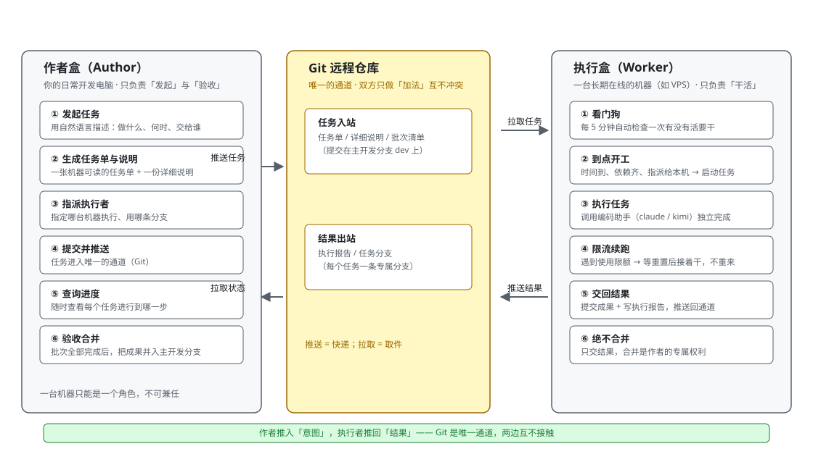
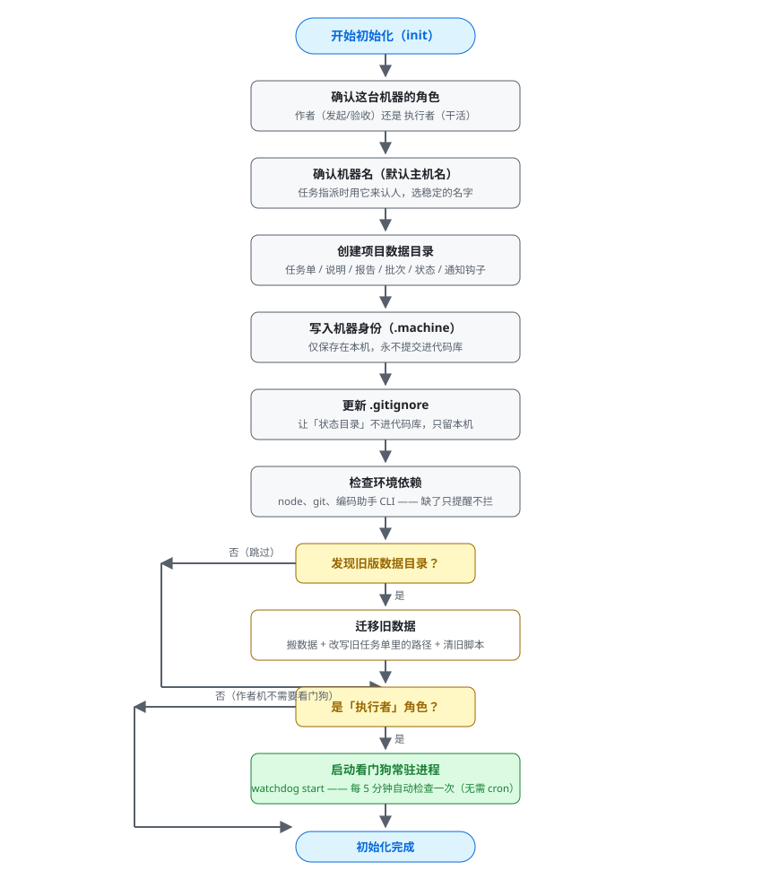
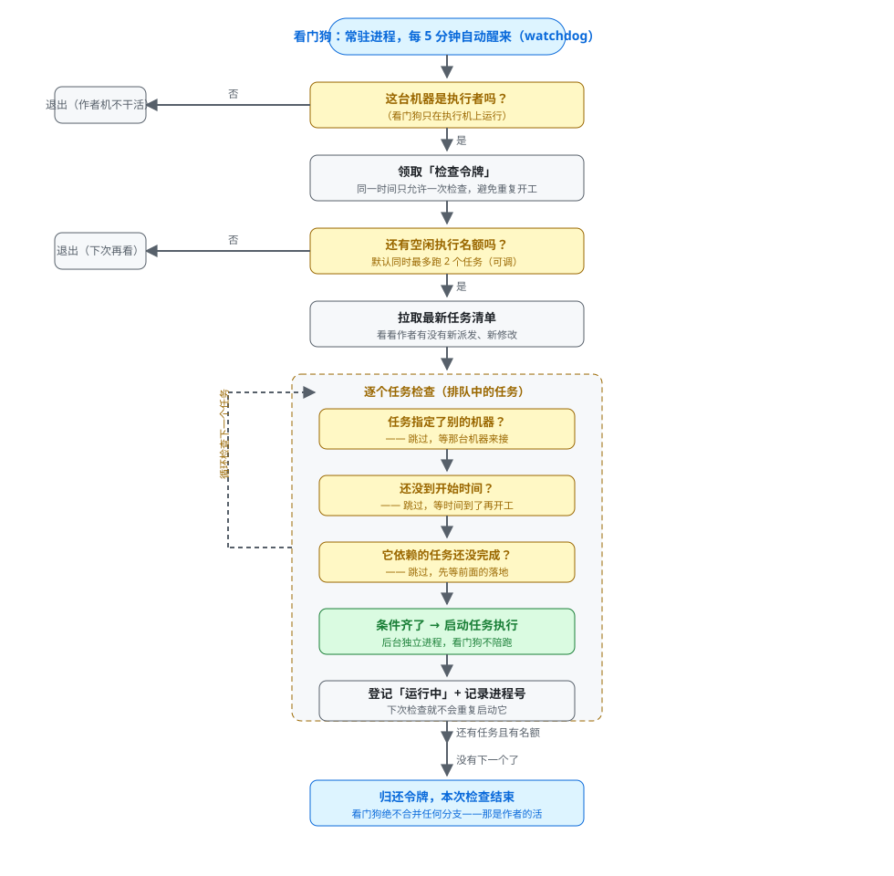
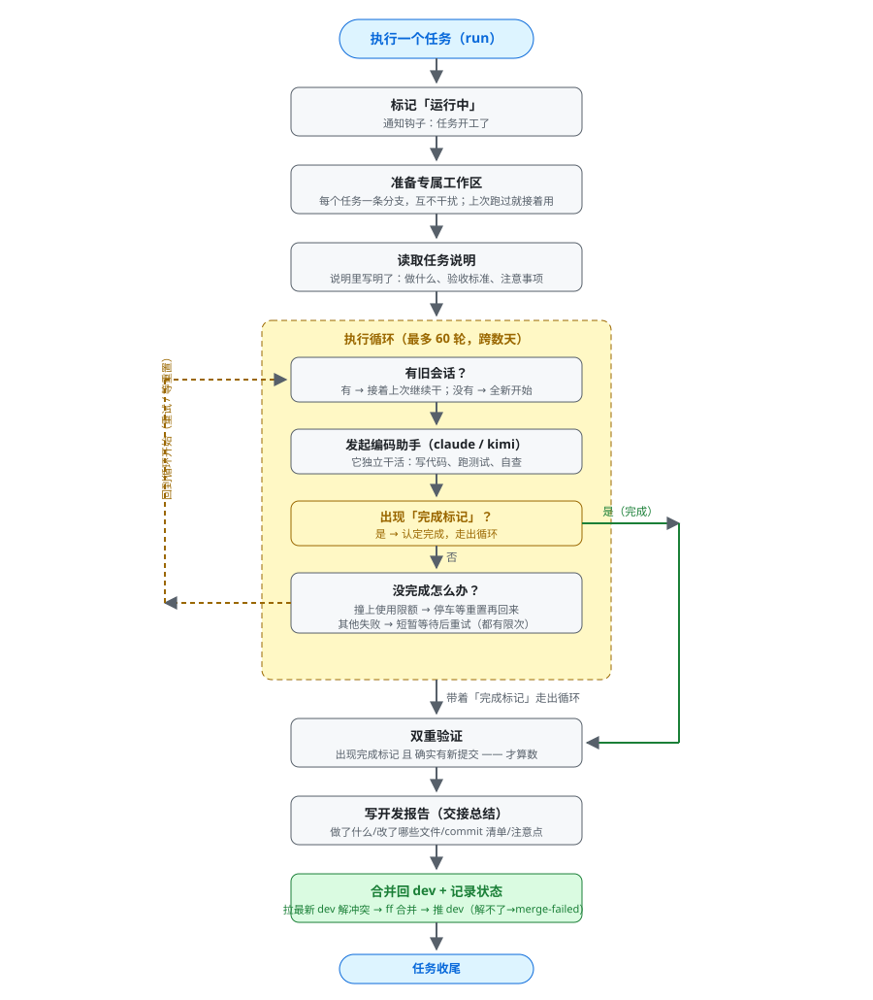
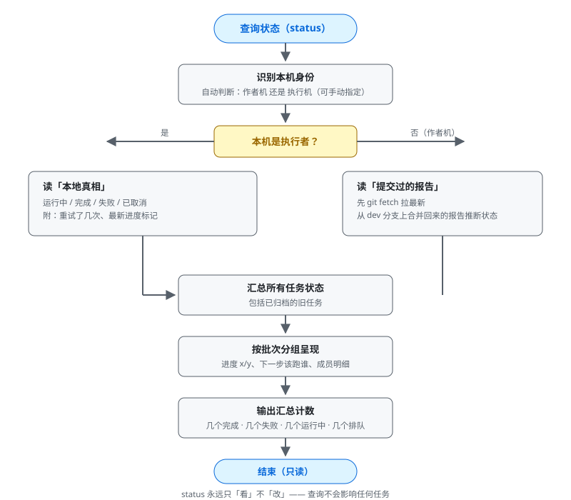
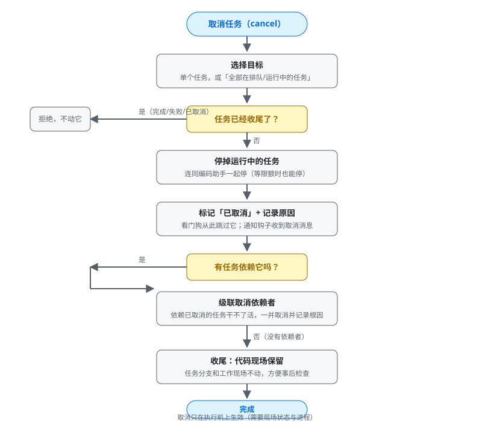

# schedule-task 业务流程梳理（业务视角，v3）

> 这份文档**不谈技术细节**，只讲清楚整个系统"谁、在什么时候、做了什么"。
> 面向使用者：了解 author（作者）与 worker（执行者）各自该做什么、系统自动做什么，
> 以便决定这套机制在你的工作流里怎么拆分、怎么用得顺手。
> 配套流程图：`docs/diagrams/*.svg`（可直接用浏览器打开，或在支持 SVG 的 Markdown 预览器中查看）。

---

## 一、整体架构：两个角色，一条通道

整个系统只有两种机器角色，一台机器只能选一种：

| 角色 | 它是谁 | 它负责 | 它绝不负责 |
|---|---|---|---|
| **作者盒（author）** | 你的日常开发电脑 | 开批次、下发任务、审查、关批次、验收 | 执行任务、合并任何分支 |
| **执行盒（worker）** | 长期在线的机器（VPS 等） | 到点自动执行任务、把成果**合并回 dev**、交回报告 | 合并别人干的活 |

两者之间**没有任何直连**——中间只有一条通道：Git 远程仓库。

```
作者推入「意图」 →  Git 仓库（任务单/说明/批次清单） →  执行者拉取后开工
作者拉取「状态」 ←  Git 仓库（dev 分支上的成果/报告） ←  执行者合并自己的成果回 dev
```



一句话总结：**作者只动嘴（发起/审查/收尾），执行者动手（干活/合并自己的成果/交报告），
Git 当邮差。作者只关心 dev 分支上东西齐不齐，从不关心任务分支。**

---

## 二、v3 生命周期：一页看懂

```
 ┌─────────────┐   ┌──────────────┐   ┌──────────────┐
 │  ① 开批次    │   │  ② 开发执行   │   │  ③ 审查       │
 │  (dev)      │   │  (worker)    │   │  (audit)     │
 └─────────────┘   └──────────────┘   └──────────────┘
 作者描述需求 →     每个任务在独立    所有 dev 任务都
 AI 拆成子任务      工作间执行 →       完成后，作者发起
 (依赖串/并联)      写报告 → 自己把    审查（用与开发者
 排好依赖 →         成果合并回 dev     不同的助手：另
 推送到 dev         (冲突自己消化)    一个人在思考)
 └─────────────┘   └──────────────┘   └──────────────┘
                                          │ 全部 audit-pass
                                     ┌────▼────────────┐
                                     │ ④ 关批次 (archive)│
                                     └─────────────────┘
                                     批次总结报告 + 收档
                                     current batch 清空
```

**四个关键约定：**

1. **同一时间只有一个批次（current batch）**。`schedule-task dev` 在还有批次开着的时候
   拒绝开新批次——先 `archive` 关掉旧的。
2. **worker 自己合并自己的成果回 dev**。任务在隔离工作间完成；完成后写开发者交接报告，
   把最新 dev 拉进自己的分支、解决冲突、再合并回 dev、重跑验收、推送。作者**从不合并、
   也不关心任务分支**——dev 就是真相。
3. **合并失败不是死路**。冲突实在解不了：worker 保留现场、推送自己的分支、把冲突细节写
   进报告、标记 `merge-failed`。作者在 status 里看到，查看分支后重派一个后续任务去解决。
4. **审查是强制的、独立的**。所有 dev 任务 `dev-done` 后，作者必须发起审查（`audit`）。
   审查用**与开发者相反的智能体**（claude ⇄ kimi），审查代码 + 存量测试是否在测真东西 +
   （edit 模式下）按自己的思路补测试。审查结论 `audit-pass` / `audit-fail`。

---

## 三、初始化：每台机器登记一次（init）

每台要参与这台系统的机器（无论作者还是执行者），都要先跑一次 **init** 登记身份。
同一个命令，选的角色不同，后续做的事情就不同。

> 前置：这台机器要先装好全局命令 `schedule-task`（跑 install.sh，工具层）并把技能绑定到
> agent（跑 `schedule-task install`，知识层）——两步安装的细节见
> `docs/refactor-three-layer-separation.md`。本节的 init 管的是数据层（每项目一份）。



流程要点：

1. **确认角色**：这台机器是「作者」还是「执行者」？二选一。
2. **确认机器名**：默认用主机名。执行者机建议改成一个稳定的名字（如 `vps-01`），
   因为发起任务时要用它来指派"这个活给哪台机器干"。
3. **建数据目录**：在项目里创建 `.schedule-tasks-data` 目录，用于放任务单、说明、报告、
   批次清单、运行状态、任务模板、通知钩子。
4. **写机器身份**：身份只保存在本机、永不提交进代码库——所以两台机器互不干扰，也不会认错人。
5. **更新 .gitignore**：让"运行状态"这类本机数据不进代码库。
6. **检查环境**：node、git、编码助手 CLI 是否齐全。缺了只提醒、不拦。
7. **迁移旧数据**（可选）：如果项目里还留着旧版的 `automation` 数据目录，init 会问是否迁移。
8. **执行者专属**：打印一行"看门狗启动命令"，执行后这台机器就有一个常驻进程每 5 分钟
   自动检查一次有没有活干。作者机不需要这步。

---

## 四、开批次与下发任务（dev，作者 + 技能协作）

作者在任意项目里说"帮我安排一批任务：XXX，明晚 2 点跑"。系统先过一道闸：

- **当前批次还开着？** 开着的批次没关，`dev` 拒绝开新批次，提示先 `archive`。

闸过了之后，技能（SKILL）会和你确认：

- 这个需求怎么拆成子任务（一个任务还是多个？串行依赖还是并行？）——由作者侧的智能体
  根据任务特性帮你拆、帮你排依赖；
- 每个子任务：做什么、验收标准是什么（大白话说，比如"测试全过"）
- 什么时候跑（一次性时间点）、交给哪台执行者（或不限）
- 有什么红线（比如"不许动 main 分支"）、用哪个编码助手（claude 默认 / kimi）

确认后，系统生成**机器可读的任务单**（JSON）+ **执行说明**（用 dev 模板拼的 Markdown），
提交并推送到 Git 仓库的 dev 分支；多子任务还会生成**批次清单**。

---

## 五、执行者的看门狗与任务执行（完全自动）

### 5.1 看门狗（每 5 分钟醒来一次）



它依次把关：

- **是执行者吗？** 作者机不会装看门狗，装了也不干活。
- **有没有空闲名额？** 默认同时最多跑 2 个任务（可调），满了就等下次。
- **任务派给我了吗？** 任务单上指名了别的机器就跳过，等那台机器接。
- **到时间了吗？** 没到点就跳过。
- **它依赖的任务完成了吗？**（依赖必须 `dev-done`）前面的没落地，后面的不动。

全部通过，看门狗就把任务启动成一个**后台独立进程**，自己立刻回去睡觉。

### 5.2 任务执行：管家式的陪跑（完全自动）



- 每个任务在**自己的专属分支 + 独立工作间**里干活，互不干扰；上次没跑完的，下次接着用。
- 调用编码助手（claude / kimi）独立完成：写代码、跑测试、自查。
- **撞上使用限额就停车等待**，等到重置时间再接着干——**绝不重来**。
- 完成后**双重验证**：出现"完成标记" 且 确实有新提交。
- **合并回 dev**：执行者把最新 dev 拉进自己的分支（冲突自己解）→ 把分支合并进 dev →
   重跑验收 → 推送 dev。管家机械地验证合并确实落地了，盖章报告，清理工作间和分支。
- **合并失败**：保留现场、推送分支、报告里写明冲突，标记 `merge-failed`，交给作者。

### 5.3 执行者的开发报告（必须写，作者与审查都靠它）

每个任务完成时，执行者要写一份**开发者交接报告**（`reports/<id>.md`），像开发干完活做
总结一样：

- 做了什么（从使用者的角度一句话）
- 改了哪些关键文件、为什么
- 提交的 commit 清单（审查者就是照这个 SHA 审的）
- 验收 gate 跑了哪些、结果如何
- 测试情况（写了什么、有没有跳过/脆弱的）
- 已知限制、设计决策、请审查者重点看哪里

---

## 六、查询状态（status，随时可查，也是默认命令）

任何时候都能问"现在进行到哪了"。**不带任何子命令直接敲 `schedule-task` 就是查状态**。
同一个命令，自动区分你是在哪台机器上查的：



- **在执行者机上查**：看的是"本地真相"——每个任务实时的运行状态、重试了几次、最新进度。
- **在作者机上查**：看的是 dev 分支上**合并回来的报告**——先拉取最新，再读报告推断状态。
  **作者不需要关心任何任务分支**；只有极少数情况（比如 `merge-failed` 要看现场）才需要
  去翻分支。

输出按批次分组：批次进度（如 `2/3 dev-done`）、下一步该跑谁、每个成员的明细；最后有汇总计数。

> 注意：status 是**只读**的，查多少次都不会影响任何任务。

### 任务状态（v3）

| 状态 | 含义 |
|---|---|
| `pending` / `running` | 排队 / 执行中 |
| `dev-done` | 开发任务完成 **且已合并回 dev**（看门狗验证过） |
| `merge-failed` | 代码写完了但合并没落地，分支已推送，等作者处理/重派 |
| `audit-pass` | 审查通过，审查结果（含新增测试）已合并回 dev |
| `audit-fail` | 审查发现需要返工的问题，分支 + 报告已推送，等作者处理 |
| `failed` / `cancelled` | 失败 / 取消 |

（旧版本里的 `done` 一律按 `dev-done` 理解。）

---

## 七、审查（audit，作者的专属一步）

所有 dev 任务 `dev-done` 之后，作者执行：

```
schedule-task audit [--readonly|--edit] [--per-task|--batch]
```

- **粒度**：`--per-task`（默认）每个 dev 任务一个审查任务，可并行；`--batch` 整个批次一个
  综合审查。作者说了算。
- **模式**：`--edit`（默认）审查者可以重写/删除无意义的存量测试（要附证据）、按自己的
  思路补新测试；`--readonly` 只读审查，一律不改。
- **智能体**：默认与开发者相反（claude ⇄ kimi）——"另一个人在思考"，结果更可信。
- 审查者要做的：审生产代码、**判断开发者的测试是不是在测真东西**（防止"测试过了但功能
  其实是坏的"这类假测试）、跑基线套件、写独立测试、最后给结论。

审查任务也在 worker 上执行：`audit-pass` → 审查者把自己的测试成果 + 报告合并回 dev；
`audit-fail` → 不合并，推分支 + 报告，作者看了 findings 再决定是否返工。

---

## 八、关批次（archive，作者的收尾一步）

所有成员（dev + audit）都到终态后（无论全过、部分失败还是全失败）：

```
schedule-task archive
```

它做的事：

1. 确认批次里没有还在跑/排队的任务，否则拒绝；
2. 写**批次总结报告**（`reports/<批次>.md`）：每个成员的结果 + Follow-ups（后续跟进建议，
   作者侧智能体可以帮忙填）；
3. 把批次清单、任务单、说明全部收进 `archive/`（留档不删）；
4. 提交、推送；
5. **current batch 清空**——可以开新批次了。

> archive 是"结束一个批次"的正式动作：它不删任何东西，只是把这一批的痕迹收档并留一个
> 总结。

---

## 九、取消任务（cancel，执行者机）

干到一半想停？或者发现安排错了？



- **排队的任务**：标记"已取消"，看门狗从此跳过它。
- **运行中的任务**：连任务进程带编码助手一起停掉（哪怕正卡在等限额）。
- **连锁反应**：如果被取消的任务是别人的前置依赖，那些等着它的任务也一并取消（记下根因）。
- 已收尾的任务（`dev-done`/`audit-pass`/`audit-fail`/`merge-failed`/`failed`/`cancelled`）
  **拒绝取消**。
- 代码工作现场会保留，方便事后检查。

> 取消只在执行者机上生效（需要本机状态和进程）。作者机想取消，得连到那台执行者机上操作。

---

## 十、命令与脚本：它们在业务上各管什么

| 命令 / 文件 | 业务上是什么 | 它做了什么 |
|---|---|---|
| `schedule-task`（入口） | 系统大门 | **不带参数 = 查状态**；带参数 = 对应命令 |
| `dev` | 开新开发批次 | 门控：当前批次没关就不许开新的；通过后进入下发流程 |
| `audit` | 发起审查 | 为当前批次已 dev-done 的任务生成审查任务（粒度/模式/智能体由作者定） |
| `archive` | 关批次 | 批次总结 + 收档 + 清空 current batch（结束一个批次的正式动作） |
| `init` | 登记入住 | 给一台机器定身份（作者/执行者）、建好项目里的数据目录、打印执行者要装的命令 |
| `status` | 进度看板 | 只看不改：所有任务现在什么状态、批次进行到哪一步 |
| `watchdog` | 看门狗 | 常驻进程：每 5 分钟自动检查有没有轮到本机的活，有就开工；可 start/stop/status |
| `run` | 任务管家 | 陪跑单个任务到结束：续跑、等限额、重试、验证、盖章报告、清理工作间 |
| `cancel` | 叫停 | 取消排队/运行中的任务，连带取消它的依赖者，保留现场 |
| `log` | 直播窗口 | 实时查看某个任务正在干嘛 |
| `migrate` | 数据格式升级 | 把项目里 `.schedule-tasks-data/version` 升到当前 CLI 的 schema；写命令在数据未迁移时会硬停并提示先跑它 |
| `doctor` | 体检 | 检查环境齐不齐、身份登记没登记、全局 CLI 包完整（bin/src + 知识三项）、已绑定技能目录（知识三项在、且不含代码，发现旧形态残留会提示重跑 install）、运行时 CLI 对不对（npm 全局 + 版本匹配）、有没有 `~/.local/bin` 旧软链接残留、数据 schema 版本 |
| `install` | 绑定知识 | 把知识三项（SKILL.md / references/ / templates/，零代码）从全局 CLI 包拷进各 agent 的 `skills/schedule-task`（整目录覆盖、幂等，自动清掉旧代码残留）；更新 = 重跑它 + 重跑 install.sh |
| `version` | 报版本 | 打印 CLI 版本号（就是 `status`/`doctor` 版本行里的那个 X） |
| `self-test` | 自检 | 跑一遍内置测试，确认系统没坏 |
| `help` / `--help` | 帮助 | 命令清单 |

内部模块（按业务职责理解，不必关心技术）：

| 模块 | 业务上是什么 |
|---|---|
| `agents.js` | 编码助手的"翻译官"：负责发起 claude/kimi、续跑会话、识别"使用限额到了" |
| `core.js` | 公共地基：机器身份、状态登记、当前批次、通知钩子 |
| `git.js` | 与 Git 通道打交道的专用助手 |
| `runner.js` | 任务管家（见上：陪跑 + 验证合并 + 盖章报告 + 清理） |
| `watchdog.js` / `dispatch.js` | 看门狗（见上）；dispatch 是看门狗内部的"该派谁"判定 |
| `status.js` | 进度看板（见上） |
| `audit.js` / `archive.js` / `cancel.js` | 发起审查 / 关批次 / 叫停（见上） |
| `init.js` / `install.js` / `log.js` / `doctor.js` | 登记 / 绑定知识 / 直播 / 体检（见上） |

---

## 十一、一张表看懂"谁该做什么"

| 场景 | 谁来做 | 怎么做的 |
|---|---|---|
| 让一台机器加入系统 | 该机器的管理员 | 跑一次 `init`，选角色、定机器名 |
| 给执行者装定时检查 | 执行者机管理员 | init 会打印 `watchdog start` 命令，执行即可（常驻进程，无需 cron） |
| 开一个开发批次 | 作者（人 + 技能） | `schedule-task dev`（门控）→ 自然语言描述 → AI 拆子任务 → 生成任务单并推送 |
| 任务自动开始执行 | 看门狗（自动） | 每 5 分钟检查，到点、派给我、依赖齐 → 开工 |
| 执行过程出意外 | 任务管家（自动） | 限流等待、失败重试、绝不重来 |
| 开发完成 | 执行者（自动） | 写开发报告 → 自己把成果合并回 dev（冲突自己解）→ 推 dev |
| 合并实在解不了 | 执行者（自动） | 保留现场 + 推分支 + 报告写明冲突 → `merge-failed` |
| 看进度 | 任何人 | `schedule-task`（无参数）或 `schedule-task status`（作者建议先 git fetch） |
| 所有 dev 任务完成 | 作者 | `schedule-task audit`（粒度/模式自选，默认 edit + 每任务一审） |
| 审查发现要返工 | 作者 | 看 `audit-fail` 的 findings → 重派后续 dev 任务 |
| 批次收尾 | 作者 | `schedule-task archive`（先确保没有还在跑的任务） |
| 不想让它跑了 | 执行者机管理员 | `schedule-task cancel <任务>`（会连带取消依赖者） |
| 环境/系统体检 | 任何人 | `schedule-task doctor` / `self-test` |

---

## 十二、当前现状小结（供你决策下一步）

- 环境依赖已收敛到 **node + git**：不需要 bash 脚本、jq、tmux 等额外工具。
- 每台机器一次 init 登记身份；作者机不需要看门狗，执行者机必须装。
- 作者与执行者通过 Git 仓库异步协作；**作者只看 dev 分支**，不看任务分支。
- **worker 负责合并自己的成果**，责任清晰；作者从不合并。
- 开发 → 审查 → 归档 三段式生命周期，同一时间一个批次。

**你可以再考量的问题**（读完这份文档后）：
1. `init` 是否拆成 `init author` / `init worker` 两个更直白的子命令？
2. 审查（audit）发现问题后，是否需要一个更顺手的"一键返工"流程（当前是作者手动重派 dev 任务）？
3. 看门狗检查间隔、并发上限等参数是否要改成按项目配置？
