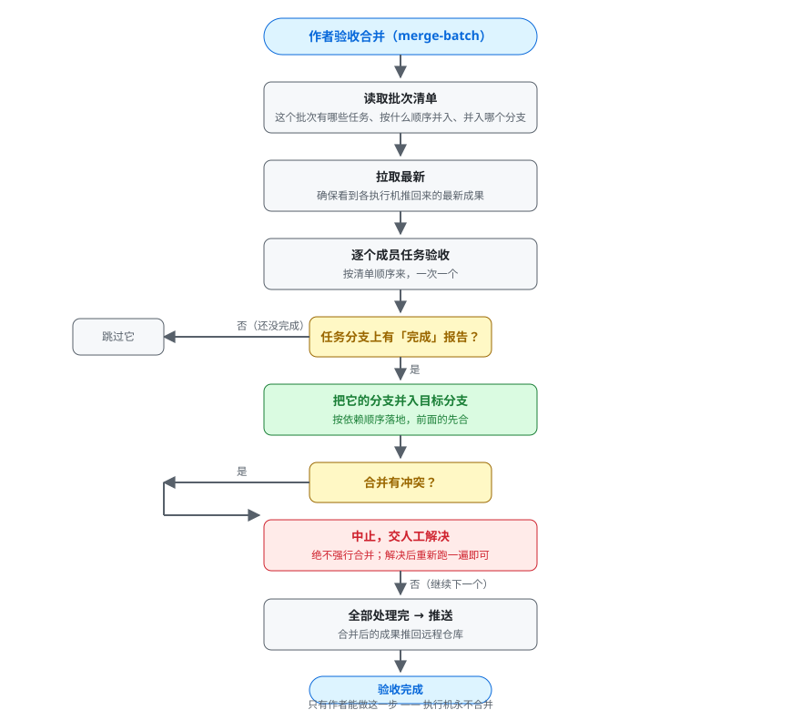

# schedule-task 业务流程梳理（业务视角）

> 这份文档**不谈技术细节**，只讲清楚整个系统"谁、在什么时候、做了什么"。
> 面向使用者：了解 author（作者）与 worker（执行者）各自该做什么、系统自动做什么，
> 以便决定这套机制在你的工作流里怎么拆分、怎么用得顺手。
> 配套流程图：`docs/diagrams/*.svg`（可直接用浏览器打开，或在支持 SVG 的 Markdown 预览器中查看）。

---

## 一、整体架构：两个角色，一条通道

整个系统只有两种机器角色，一台机器只能选一种：

| 角色 | 它是谁 | 它负责 | 它绝不负责 |
|---|---|---|---|
| **作者盒（author）** | 你的日常开发电脑 | 发起任务、查询进度、验收合并 | 执行任务、合并由它之外的东西代劳 |
| **执行盒（worker）** | 长期在线的机器（VPS 等） | 到点自动执行任务、交回结果 | 合并任何分支 |

两者之间**没有任何直连**——中间只有一条通道：Git 远程仓库。

```
作者推入「意图」 →  Git 仓库（任务单/说明/批次清单） →  执行者拉取后开工
作者拉取「状态」 ←  Git 仓库（报告/任务分支）        ←  执行者推回结果
```


一句话总结：**作者只动嘴（发起/验收），执行者只动手（干活/交结果），Git 当邮差。**

---

## 二、初始化：每台机器登记一次（init）

每台要参与这台系统的机器（无论作者还是执行者），都要先跑一次 **init** 登记身份。
同一个命令，选的角色不同，后续做的事情就不同。


流程要点：

1. **确认角色**：这台机器是「作者」还是「执行者」？二选一。
2. **确认机器名**：默认用主机名。执行者机建议改成一个稳定的名字（如 `vps-01`），
   因为发起任务时要用它来指派"这个活给哪台机器干"。
3. **建数据目录**：在项目里创建 `.schedule-tasks-data` 目录，用于放任务单、说明、报告、
   批次清单、运行状态、通知钩子。
4. **写机器身份**：身份只保存在本机、永不提交进代码库——所以两台机器互不干扰，也不会认错人。
5. **更新 .gitignore**：让"运行状态"这类本机数据不进代码库。
6. **检查环境**：node、git、编码助手 CLI 是否齐全。缺了只提醒、不拦。
7. **迁移旧数据**（可选）：如果项目里还留着旧版的 `automation` 数据目录，init 会问是否迁移。
8. **执行者专属**：打印一行"看门狗启动命令"——`schedule-task watchdog start`，执行后这台
   机器就有一个常驻进程每 5 分钟自动检查一次有没有活干。作者机不需要这步。

> 关于"要不要把 init 拆成 `author init` / `worker init` 两个命令"：
> 现状是一个命令、按角色分支；是否拆分属于体验优化，读完这份文档后可以再议。

---

## 三、任务的一生：从发起到落地

### 3.1 作者发起（人 + 技能协作）

作者在任意项目里，用自然语言说"帮我安排一个任务：XXX，明晚 2 点跑"。技能（SKILL）会和你确认：

- 做什么、验收标准是什么（用大白话说，比如"测试全过"）
- 什么时候跑（一次性时间点）
- 交给哪台执行者（或不限）
- 有什么红线（比如"不许动 main 分支"）
- 用哪个编码助手（claude 默认 / kimi）

确认后，系统生成一份**机器可读的任务单**（JSON）+ 一份**详细的执行说明**（Markdown），
提交并推送到 Git 仓库的主开发分支。如果是多步骤的大需求，还会生成**批次清单**，
把任务按依赖关系排好序。

### 3.2 执行者的看门狗（完全自动）

执行者机器上跑着一个看门狗，每 5 分钟自动醒来一次，检查有没有轮到自己的活。


它依次把关：

- **是执行者吗？** 作者机不会装看门狗，装了也不干活。
- **有没有空闲名额？** 默认同时最多跑 2 个任务（可调），满了就等下次。
- **任务派给我了吗？** 任务单上指名了别的机器就跳过，等那台机器接。
- **到时间了吗？** 没到点就跳过。
- **它依赖的任务完成了吗？** 前面的没落地，后面的不动。

全部通过，看门狗就把任务启动成一个**后台独立进程**，自己立刻回去睡觉——
多长时间的活都不占它的时间。

### 3.3 任务执行：管家式的陪跑（完全自动）

任务启动后，由"任务管家"负责陪跑到结束。它最有耐心，因为一个任务可能跑好几个小时、
甚至跨好几天（比如反复撞上编码助手的使用限额）。


管家做的事：

- 每个任务在**自己的专属分支**上干活，互不干扰；上次没跑完的，下次接着用同一块工作区。
- 调用编码助手（claude / kimi）独立完成：写代码、跑测试、自查。
- **撞上使用限额就停车等待**，等到重置时间再接着干——**绝不重来**，会话和上下文都保留。
- 普通失败则短暂等待后重试；反复失败会先放弃旧会话、全新跑一遍；重试到上限才判定失败。
- 完成后**双重验证**：出现"完成标记" 且 确实有新提交，才认定成功。
- 写一份执行报告（结果摘要），把成果和报告推送回 Git，记录最终状态（完成/失败）。

全程不需要人介入。看报告就能知道它干得怎么样。

---

## 四、查询状态（status，随时可查）

任何时候都能问"现在进行到哪了"。同一个命令，自动区分你是在哪台机器上查的：


- **在执行者机上查**：看的是"本地真相"——每个任务实时的运行状态、重试了几次、最新进度。
- **在作者机上查**：看的是"提交过的报告"——先拉取最新，再从每个任务分支上的报告推断状态。
  （执行者机上的实时状态不会同步过来，所以正在跑的任务在作者机上显示为"排队中"是正常的。）

输出按批次分组：批次进度（如 `2/3 完成`）、下一步该跑谁、每个成员的明细；最后有一行汇总计数。

> 注意：status 是**只读**的，查多少次都不会影响任何任务。

---

## 五、取消任务（cancel）

干到一半想停？或者发现安排错了？


- **排队的任务**：标记"已取消"，看门狗从此跳过它。
- **运行中的任务**：连任务进程带编码助手一起停掉（哪怕正卡在等限额）。
- **连锁反应**：如果被取消的任务是别人的前置依赖，那些等着它的任务也一并取消（记下根因），
  因为它们已经不可能干成了。
- 已经收尾的任务（完成/失败/已取消）**拒绝取消**，防止误操作。
- 代码工作现场会保留，方便事后检查。

> 取消只在执行者机上生效（需要本机状态和进程）。作者机想取消，得连到那台执行者机上操作。

---

## 六、批次验收与合并（merge-batch，作者的专属一步）

一个批次的所有任务都完成后，**由作者执行最后一步：验收合并**。这是全系统唯一的合并入口。



流程：

1. 读批次清单：有哪些成员、按什么顺序并入、并入哪个分支（默认 `dev`）。
2. 拉取最新，确保看到各执行者推回的成果。
3. 逐个成员验收：
   - 该任务分支上有"完成"报告 → 把它并入目标分支（按依赖顺序）。
   - 没有"完成"报告 → 跳过（还没干完，不硬合）。
4. 如果合并撞上代码冲突 → **立即中止**，交人工解决；解决后重新跑一遍即可（已合并的不会重复合并）。
5. 全部处理完 → 推送到远程仓库。

> 为什么执行者绝不合并？因为只有作者清楚"整个批次是否真的该落地"。
> 执行者只负责把成果交回来，验收权始终在作者手里。想走代码评审的，
> 也可以先在本机合并好、再以 PR 形式推给团队审。

---

## 七、命令与脚本：它们在业务上各管什么

以下是一个命令/脚本 = 一件业务事，用大白话描述：

| 命令 / 文件 | 业务上是什么 | 它做了什么 |
|---|---|---|
| `schedule-task`（入口） | 系统大门 | 所有操作的统一入口，你说一句话它去调度 |
| `init` | 登记入住 | 给一台机器定身份（作者/执行者）、建好项目里的数据目录、打印执行者要装的定时命令 |
| `status` | 进度看板 | 只看不改：所有任务现在什么状态、批次进行到哪一步 |
| `watchdog` | 看门狗 | 常驻进程：每 5 分钟自动检查有没有轮到本机的活，有就开工；可 start/stop/status 管理；绝不合并 |
| `run` | 任务管家 | 陪跑单个任务到结束：续跑、等限额、重试、验证、写报告、交结果 |
| `cancel` | 叫停 | 取消排队/运行中的任务，连带取消它的依赖者，保留现场 |
| `archive` | 归档 | 把已结束的任务单+说明收进档案区（留档不删），让待办列表干净 |
| `merge-batch` | 作者验收 | 批次全完成后，把各任务的成果按顺序并入主开发分支 |
| `log` | 直播窗口 | 实时查看某个任务正在干嘛（替代过去的 tmux 盯屏） |
| `doctor` | 体检 | 检查这台机器环境齐不齐、身份登记没登记 |
| `update` | 自我升级 | 拉取技能和运行时的最新版本 |
| `self-test` | 自检 | 跑一遍内置测试，确认系统没坏 |

内部模块（按业务职责理解，不必关心技术）：

| 模块 | 业务上是什么 |
|---|---|
| `agents.js` | 编码助手的"翻译官"：负责发起 claude/kimi、续跑会话、识别"使用限额到了" |
| `core.js` | 公共地基：机器身份、状态登记、通知钩子 |
| `git.js` | 与 Git 通道打交道的专用助手 |
| `runner.js` | 任务管家（见上） |
| `watchdog.js` | 看门狗（见上） |
| `status.js` | 进度看板（见上） |
| `cancel.js` / `archive.js` / `merge-batch.js` | 叫停 / 归档 / 验收（见上） |
| `init.js` / `log.js` / `doctor.js` | 登记 / 直播 / 体检（见上） |

---

## 八、一张表看懂"谁该做什么"

| 场景 | 谁来做 | 怎么做的 |
|---|---|---|
| 让一台机器加入系统 | 该机器的管理员 | 跑一次 `init`，选角色、定机器名 |
| 给执行者装定时检查 | 执行者机管理员 | init 会打印 `watchdog start` 命令，执行即可（常驻进程，无需 cron） |
| 安排一个任务/一批任务 | 作者（人 + 技能） | 自然语言描述 → 确认 → 自动生成任务单并推送 |
| 任务自动开始执行 | 看门狗（自动） | 每 5 分钟检查，到点、派给我、依赖齐 → 开工 |
| 执行过程出意外 | 任务管家（自动） | 限流等待、失败重试、绝不重来 |
| 看进度 | 任何人（作者建议先 git fetch） | `schedule-task status` |
| 不想让它跑了 | 执行者机管理员 | `schedule-task cancel <任务>`（会连带取消依赖者） |
| 批次全部完成 | 作者 | `schedule-task merge-batch <批次>`（唯一合并入口） |
| 清理已完成任务 | 作者 | `schedule-task archive <任务>`（留档不删） |
| 环境/系统体检 | 任何人 | `schedule-task doctor` / `self-test` |

---

## 九、当前现状小结（供你决策下一步）

- 环境依赖已收敛到 **node + git**：不需要 bash 脚本、jq、tmux 等额外工具。
- 每台机器一次 init 登记身份；作者机不需要看门狗，执行者机必须装。
- 作者与执行者通过 Git 仓库异步协作，互不接触、互不干扰。
- 执行全程无人值守：发起后到验收前，系统自己管自己。

**你可以再考量的问题**（读完这份文档后）：
1. `init` 是否拆成 `init author` / `init worker` 两个更直白的子命令？
2. 一台机器上是否可能同时需要"作者+执行者"双身份（现状是一台机器一个角色）？
3. 看门狗检查间隔、并发上限等参数是否要改成按项目配置？

这些不影响系统当前运转——梳理清楚后，我们再按你的决定排更新计划。
